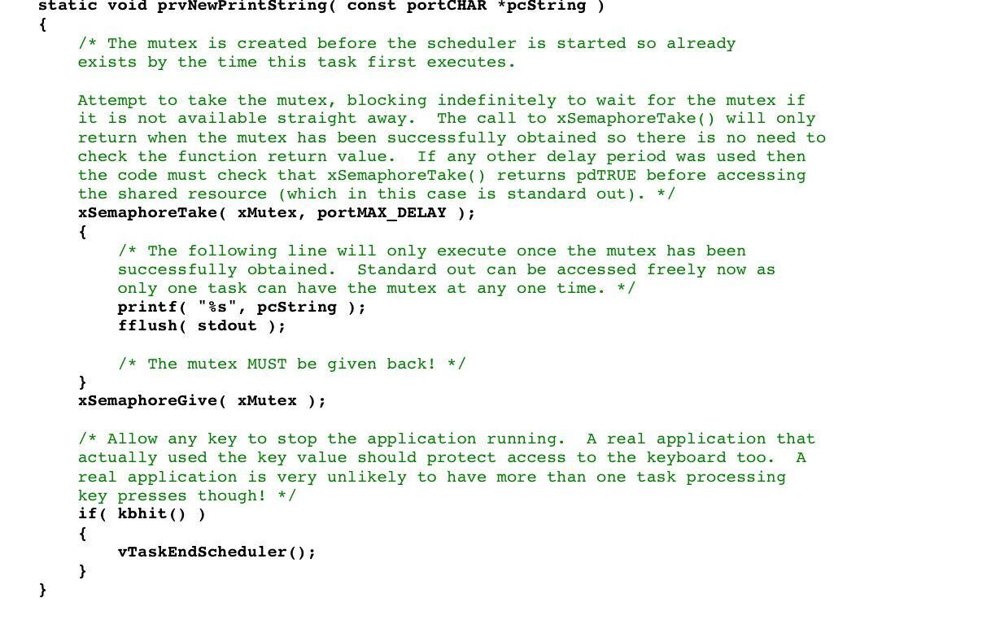
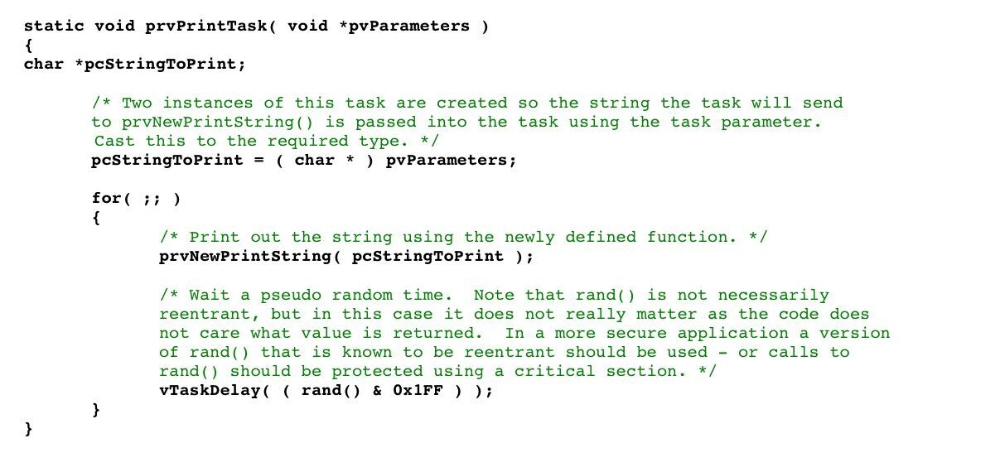
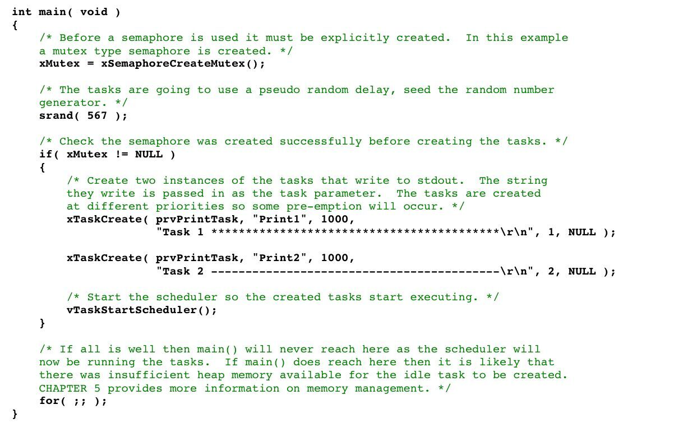
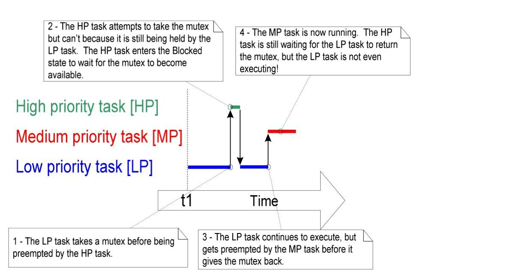
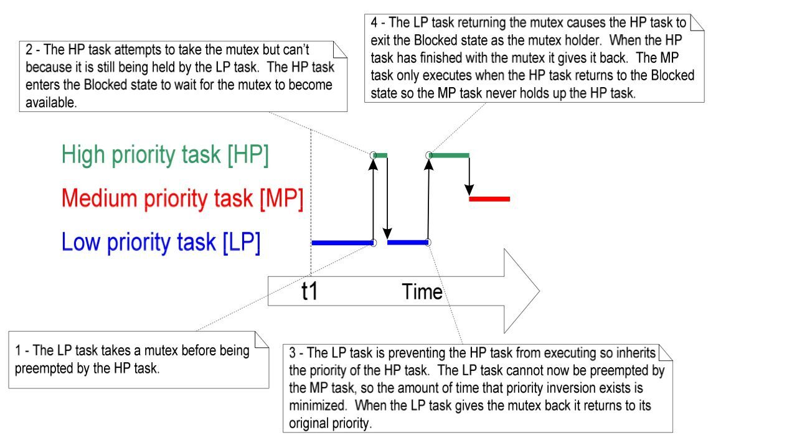

# 本部分内容概述：

多任务系统中可能存在潜在的冲突，如果一个任务在访问资源时，没有完全获取到其中所有的资源就被强制从运行态退出了，那么该任务留下的资源就不连贯，如果该资源又被其他任务或者中断获取了，那么就可能导致该数据崩溃或者其他错误。

四个有关越权访问的例子：

1.访问外设

两个任务试图同时对LCD进行写操作。

-任务A将"Hello World"写入到LCD中

-任务A在输出"Hello"后该任务就被任务B抢占

-任务B在进入阻塞态之前将"Abort,Retry,Fail"写到LCD中

-任务A继续从之前被中断的点继续写入"World"

那么LCD输出的就是"Hello Abort,Retry,Fail World"

2.读，改，和写操作


这是ARM7的汇编指令，其C代码是将PORTA的值与0x01相或，再将值赋给PORTA。

但是看出其汇编代码不止一条语句，所以这是一个非原子（non-atomic）操作。

-任务A将PORTA的值加载到寄存器R0中

-任务A在完成修改和写操作之前被任务B抢占

-任务B改变了PORTA的值，之后进入阻塞态

-任务A继续从按照抢占前的任务运行，之后任务A将PORTA的值传入R1寄存器，将0x01的值赋给R2，再将R1与R2的值相或，再将值传回PORTA

可以看出任务B已经改变了PORTA的值，所以其实任务A传入到内存中的值是错的。

3.非原子操作访问变量


4.函数的再调用


---

## 互斥锁

任务与任务之间,以及任务与中断访问共享资源时，有必要用到互斥锁来保证数据的一致性，其目的是保证任务在访问共享资源时，同一个任务在共享资源返回一个一致态是必须拥有互斥权限。

FreeRTOS中提供了几个特性可以用来实现互斥锁，但是最佳的方式是设计程序中的资源不能被共享而且每个资源只能被一个任务访问。

---

## 临界区以及调度器挂起

**基础临界区：**
基础临界区是一段由taskENTER_CRITICAL()以及taskEXIT_CRITICAL()之间代码区。

```C:
    taskENTER_CRITICAL();

    PORTA|=0x01;

    taskEXIT_CRITICAL();
```

这种临界区的实现方式显得有点粗糙，该项目只是简单的完全禁止中断了或者禁止直到由configMAX_SYSCALL_INTERRUPT_PRIORITY的中断。
抢占内容的转换只能发生在中断内部，所以只要中断保持禁止，调用了taskENTER_CRITICAL()的任务就可以一直保持在运行态。

临界区中的代码必须尽量的简短，否则其可能会影响中断响应时间，每个临界区宏taskENTER_CRITICAL()都要有一个与之配对的taskEXIT_CRITICAL()。

**调度器挂起：** 临界区也可以由调度器挂起实现，调度器挂起有时候也叫做**调度器死锁**，基础临界区保证了区内的代码不会受到中断或者其他任务的干扰。

临界区内代码段如果过长而不能实现的可以由调度器挂起实现，而且恢复调度器也是有必要的。

两个基础的API函数

```C：
        void vTaskSuspendAll(void);

        portBASE_TYPE xTaskResumeAll(void);
```

---

## 互斥量

互斥量是一种特殊类型的二进制信号量，其用于控制多个任务间共享资源的访问权限。

互斥量可以看做是互斥锁的标志量（token）。一个任务如果想访问资源必须要先持有标志量，当任务结束资源访问后必须将标志量归还，只有当标志量归还后其他的任务才可以获得标志量和访问共享资源。


xSemaphoreCreateMutex() API函数：

```C:
        xSemaphoreHandle xSemaphoreCreateMutex(void);
```

该信号API具有返回值，如果返回值为NULL，代表内存没有足够的堆空间用于创建信号量。

下面是该例程的程序：







首先，程序运行进入空闲态，延迟结束后任务1抢占了空闲任务，之后任务一获得了标志量，在任务1准备输完整个字符之前，由于任务1的优先级没有任务2的优先级高，所以任务1会被任务2抢占，但由于此时标志量依然被任务1所持有，所以任务2进入阻塞态，任务1继续执行，直到任务1归还标志量，任务2开始写操作，之后任务2将标志量归还，此时执行delay，任务1又会执行，任务一此时也执行delay，之后系统进入空闲态，直到下一次任务执行。

---

### 优先级反转

用互斥量来实现互斥其实存在一种潜在的缺陷，在上面这种情况下高优先级的任务必须等待低优先级的任务先执行的情况叫做**优先级反转**，不过这个存在一个问题，就是如果再有一个任务三，其优先级介于任务1和任务2之间的时候，或者优先级大于等于任务1就行，这样的话其实在任务1获得互斥量的时候，任务2会进入阻塞态，所以当任务1归还了互斥量之后，系统可能会先执行任务3。具体可以参考下面这张图：


可以看出LP在被HP抢占前已经获得了互斥量，然后HP会尝试拿走互斥量，然而LP还没有将其归还，然后LP继续执行，但是之后有可能又被MP这个任务抢占，在将其归还前被反复抢占。

### 优先级的继承

FreeRTOS存在一种继承机制，这可以降低优先级反转的危害。

其原理是互斥量持有任务会继承当前等待任务的优先级，所以你可以看出，一般等待任务可能LP，所以在继承了LP这个优先级以后，MP就不能抢占LP。

如下图所示：



和上面的图一样，LP会先持有互斥量，然后HP试图抢占任务，但是由于LP依然持有该互斥量，所以HP抢占失败，进入阻塞态。LP任务防止HP执行所以继承了HP的优先级，所以现在LP也不能被MP抢占了，等到LP归还互斥量后，HP退出阻塞态，之后只有等HP执行了完后归还了互斥量MP才能执行。

### 死锁

死锁是当两个任务都不会继续执行，而是在等待对方归还持有的互斥量时的情况。

如果存在一个任务A持有互斥量X，然后任务A被任务B抢占，之后执行任务B，且任务B持有一个互斥量Y，之后任务B试图获取互斥量X，但是互斥量X被A持有，之后任务B可能会进入阻塞态等待任务A归还互斥量X，然后任务A继续执行，之后任务A试图或许互斥量Y，然后任务A也会进入阻塞态。

之后A，B两个任务都在等待对方归还互斥量，死锁就发生了。


## 守门员任务

守门员任务可以避免优先级反转和死锁的发生。

守门员任务是一种只能持有资源的任务。只有当守门员任务被允许直接获取资源时——也就是说其他任务要想获取资源只能通过间接调用守门员任务。


