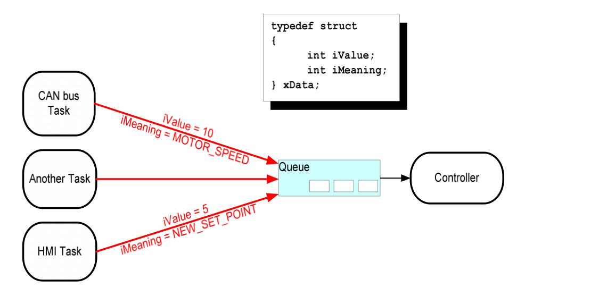
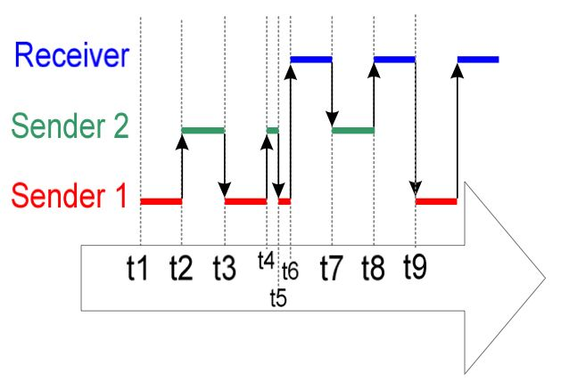

# Queue Management

# Using Queue to Transfer Compound Types

一般来说，一个任务可以接收到多个数据源传送到队列中的数据。

所以，如果接收的任务知道具体的数据来源，之后通过识别来源可以更好的处理数据。一个简单的实现就是使用**结构体**，里面既包含数据和数据来源的相关信息。

如下图所示：



CAN bus Task,HMI task，以及其他的一些任务都指向了队列（~~多P~~）

下面详细介绍一下这张图所表示的内容，

首先，新建一个队列，其中item的类型是*xData*,xData的定义如下:

```C
    typedef struct
    {
            int iValue;
            int iMeaning;
    } xData;
```

第一个iValue是传入的值，第二代表数据传入的方式。

控制器这个任务是实现系统功能。其会对输入信号产生应答，并且转为系统状态（system state）

CAN bus Task是压缩CAN总线接口功能的任务。当CAN总线任务接收到信息后立即将其译码，之后将解码后的信息以xData类型传给控制器、

HMI（Human Machine Interface) Task, 人机接口任务，是用来压缩所有HMI功能的任务。Machine Operator可以输入命令（或者~~指令？~~），以及查询HMI Task内部检测到的值。当新的命令命令后，HMI Task就会将指令以xData的形式传给控制器。结构体中iMeaning告诉控制任务传入的数据是什么（图中的则是一个新的set point)，iValue则告诉控制任务新的set point具体的值。

---

>下面是第十一个例程(~~Not very hard!~~

与例10的代码大致相同，只不过接收任务和发送任务的优先级交换了。

```C
    typedef struct
    {
        unsigned char ucValue;
        unsigned char ucSource;
    }  xData;

    static const xData xStructsToSend[2]=
    {
        {100, mainSender_1},
        {200, mainSender_2}
    }
```

例10中的接收任务优先级最高，所以队列中永远不会有超过一个Item的存在，因为发送任务一旦给队列发送数据后就会马上被其接收，而在例11中，发送任务的优先级高于接收任务，所以队列很容易变成常满状态，这是因为，接收任务刚从队列中移除一个数据马上就会被发送任务填满，之后发送任务又进入了阻塞态。

几个比较重要的API任务的介绍：

```C:
        portBASE_TYPE xQueueSendToBack(
            xQueueHandle xQueue,
            const void* pvItemToQueue,
            portTickType xTicksToWait
        );  /*将Item送入队列的尾部*/

        portBASE_TYPE xQueueSendToFront(
            xQueueHandle xQueue,
            const void* pvItemToQueue,
            portTickType xTicksToWait
        );      /*将Item送入队列的头部*/

        portBASE_TYPE xQueueReceive(
            xQueueHandle xQueue,
            const void* pvBuffer,
            portTickType xTicksToWait
        );      /*获取Item，将其从队列中移除*/

        portBASE_TYPE xQueuePeek(
            xQueueHandle xQueue,
            const void* pvBuffer,
            portTickType xTicksToWait
        );      /*获取Item，不将其从队列中移除*/
         
        portBASE_TYPE uxQueueMessagesWaiting(
            xQueueHandle xQueue
        );      /*查询当前队列中Item的数目*/
```

main中有的xQueue一共3个xData。其运行时序图如下：



---

# Working With Large Data:

当存储在队里中的数据量太大了时，将其值一个个传入队列会浪费大量的内存，所以这种情况下使用指针效率更高一点。传输指针（Transferring pointer)的使用可以大大降低运行时间，且可以提高内存的利用率。

队列指针的注意事项如下：

1.指向内存的指针必须要有清晰的定义：

任务间共享内存资源时指针必须保证两个任务不能同时改动内存中的内容,否则会导致内存中的数据无效或者不一致。理想情况下，在内存指针被创建之前，只有传输任务能获取访问内存权限，而只有内存指针从队列中被接收到后，接收任务才能获得访问内存的权限。

2.被指向的内存必须保证有效：
如果一个内存是被动态分配的，那么必须要保证某个任务要释放该内存，而且在该内存被释放后，没有任何任务拥有访问内存的权限。

